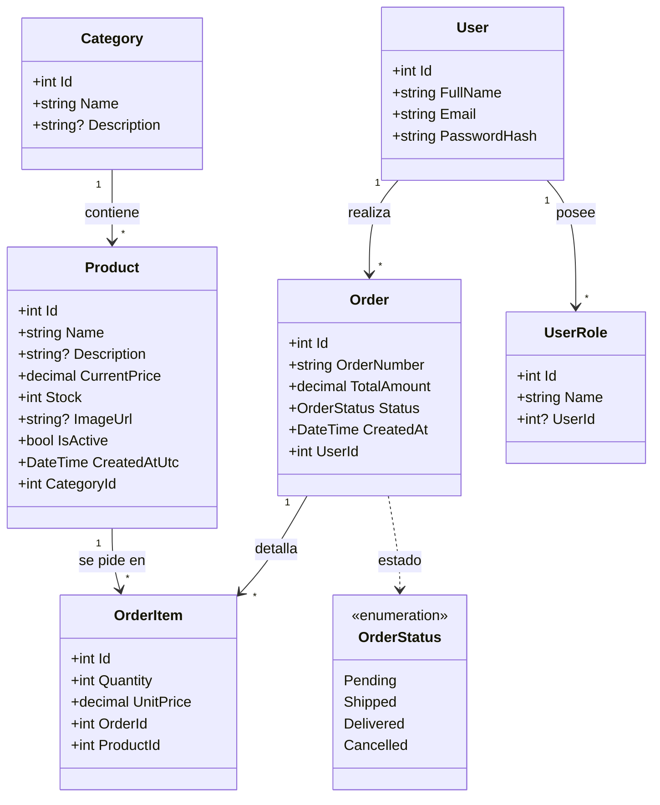
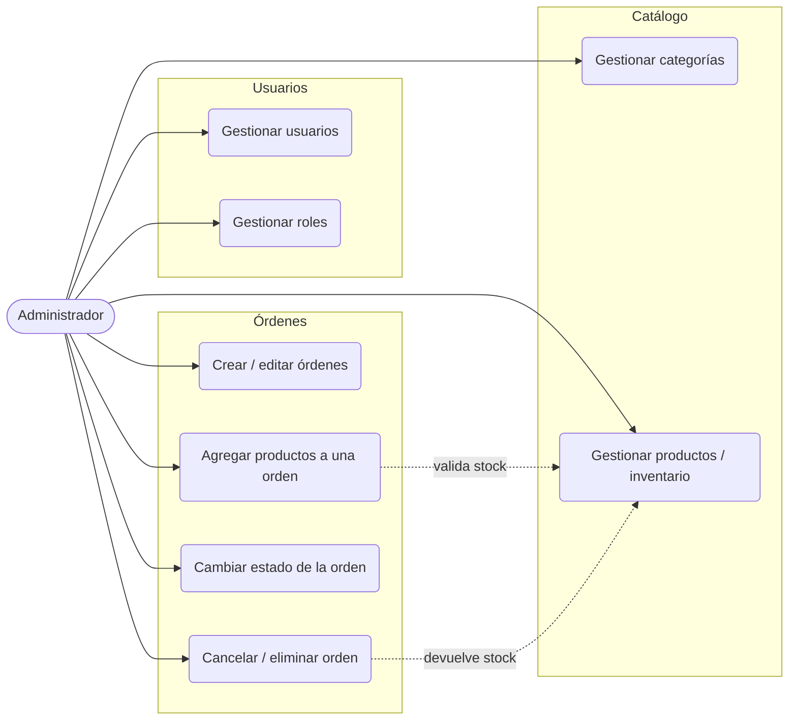
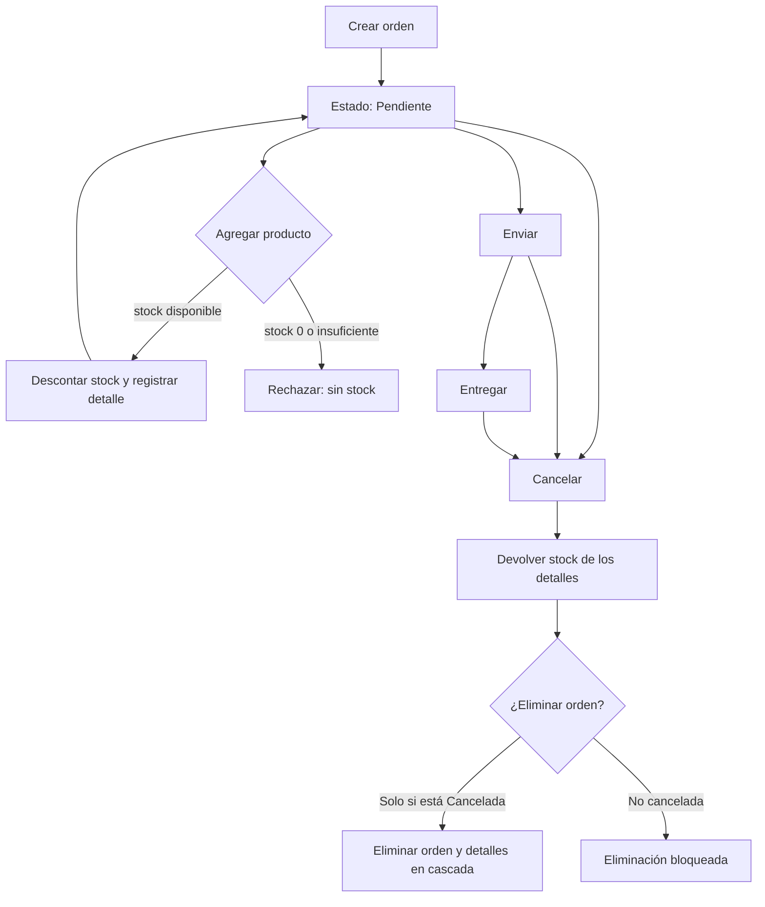

# ShopEasy MVC

Aplicación web de gestión para una tienda en línea (catálogo, inventario, usuarios y órdenes), construida con **ASP.NET Core MVC** y **Entity Framework Core**. Los montos se manejan en **colones costarricenses (₡)**.

## Tecnologías

| Componente | Detalle |
|------------|---------|
| Framework | ASP.NET Core MVC (.NET 10) |
| ORM | Entity Framework Core 10 (SQL Server) |
| Base de datos | SQL Server LocalDB |
| Front-end | Razor Views, Bootstrap 5, jQuery |
| Patrón | MVC (Modelo–Vista–Controlador) |

## Funcionalidades

- **Categorías**: CRUD con nombre único.
- **Productos / Inventario**: CRUD, búsqueda y filtros por categoría y disponibilidad (en stock, stock bajo, agotado), imágenes ampliables al hacer clic.
- **Usuarios y Roles**: CRUD de usuarios con asignación de rol y catálogo de roles.
- **Órdenes**: número correlativo automático (`ORD-AÑO-001`), filtro por estado y cambio de estado.
- **Detalles de orden**: agregar productos a una orden con autocompletado de precio.
- **Reglas de negocio**:
  - Solo se agregan productos a órdenes **Pendientes**.
  - Agregar un producto **descuenta** stock; cancelar la orden lo **devuelve**.
  - No se pueden agregar productos **agotados** ni más de lo disponible.
  - Una orden solo se **elimina** si está **Cancelada** (sus detalles se borran en cascada).

## Estructura del proyecto

```
ShopEasyMVC/
├── Controllers/      # Categories, Products, Orders, OrderItems, Users, UserRoles, Home
├── Data/             # AppDbContext, DbSeeder
├── Helpers/          # CurrencyExtensions (₡), EnumExtensions
├── Models/           # Category, Product, User, UserRole, Order, OrderItem, OrderStatus
├── Migrations/       # InitialCreate
├── Views/            # Vistas Razor por controlador
└── wwwroot/          # css, js (image-modal, order-item-price), lib
```

## Diagrama de clases



> Relaciones de borrado: `Order → OrderItem` en **cascada**; `Category → Product`, `User → Order` y `Product → OrderItem` con **Restrict**; `User → UserRole` en cascada (un `UserRole` con `UserId` nulo es un rol de catálogo).

## Diagrama de casos de uso



## Diagrama de flujo — ciclo de vida de una orden e inventario



## Puesta en marcha

### Requisitos
- SDK de **.NET 10**
- **SQL Server LocalDB** (incluido con Visual Studio)

### Pasos

```bash
# 1. Restaurar y compilar
dotnet build

# 2. Ejecutar (aplica migraciones y siembra datos automáticamente)
dotnet run --project ShopEasyMVC
```

La aplicación queda disponible en `https://localhost:7083` y `http://localhost:5258`.

Al iniciar, `DbSeeder` aplica las migraciones y, si la base está vacía, carga datos de ejemplo: roles, usuarios, categorías, productos y órdenes (con el stock ya ajustado por las órdenes no canceladas).

> Cadena de conexión en `appsettings.json` (`DefaultConnection`). Para reiniciar los datos: `dotnet ef database drop` y volver a ejecutar.

### Datos de ejemplo

| Usuario | Correo | Rol |
|---------|--------|-----|
| Admin ShopEasy | admin@shopeasy.com | admin |
| Cliente Demo | cliente@shopeasy.com | cliente |
